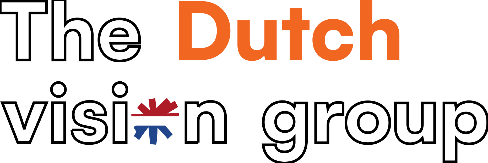

<p align="center">
  
</p>

<p align="center">
   Deze repository bevat de gedeelde skills voor de AI-gestuurde ontwikkeling binnen The Dutch Vision Group.
</p>

## Installatie

De skills in de map `skills/` kunnen globaal worden geïnstalleerd in Windsurf, zodat ze beschikbaar zijn in alle workspaces en niet door eindgebruikers hoeven worden aangepast. De installatie kopieert de volledige inhoud van de `skills/`-map naar de globale Windsurf skills-map. Als er al skills aanwezig zijn in de doelmap worden deze eerst verwijderd en overschreven.

### Doelmap

De scripts installeren naar de globale skills-map van Windsurf, op alle besturingssystemen:

```
~/.codeium/windsurf/skills/
```

Op Windows is dit `%USERPROFILE%\.codeium\windsurf\skills\`.

### Uitvoeren

**macOS / Linux / WSL** — voer het bash-script uit vanuit de root van deze repository:

```bash
bash scripts/windsurf-install.sh
```

**Windows** — open PowerShell en voer het volgende uit vanuit de root van deze repository:

```powershell
.\scripts\windsurf-install.ps1
```

### Wat doet het script?

1. Bepaalt de locatie van de `skills/`-map op basis van de scriptlocatie.
2. Stelt de doelmap in op `~/.codeium/windsurf/skills/`.
3. Maakt de bovenliggende map aan als deze nog niet bestaat.
4. Verwijdert de bestaande doelmap als deze al bestaat (clear + overwrite).
5. Kopieert de volledige `skills/`-map naar de doelmap.