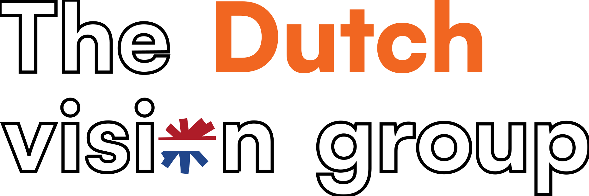

<p align="center">
  
</p>

<p align="center">
   Deze repository bevat de gedeelde skills voor de AI-gestuurde ontwikkeling binnen The Dutch Vision Group.
</p>

## Installatie

Het script `scripts/link.py` symlinkt de skills uit `skills/` naar de globale skills-mappen van de ondersteunde agent harnesses. Daarnaast synchroniseert het de OpenCode- en Claude Code-configuratie (zie de secties hieronder). Omdat het symlinks zijn, blijft deze repo het enige source of truth — een wijziging aan een skill is direct zichtbaar in elke gelinkte harness.

### Ondersteunde harnesses

| Harness                | Global path                              | Leest `~/.agents/skills/`? |
| ---------------------- | ---------------------------------------- | :-----------------------: |
| Universal (`.agents`)  | `~/.agents/skills/`                      | — (is zelf het pad)      |
| OpenCode               | `~/.config/opencode/skills/`             | ✅                        |
| Zed                    | `~/.agents/skills/`                      | ✅                        |
| Codex CLI              | `~/.agents/skills/`                      | ✅                        |
| GitHub Copilot (VS Code) | `~/.copilot/skills/`                   | ✅                        |
| Cursor                 | `~/.cursor/skills/`                      | ✅                        |
| Gemini CLI             | `~/.gemini/skills/`                      | ✅                        |
| Claude Code            | `~/.claude/skills/`                      | ❌                        |
| Windsurf (Cascade)     | `~/.codeium/windsurf/skills/`            | ❌                        |
| Google Antigravity     | `~/.gemini/config/skills/`               | ❌                        |

Eén symlink naar `~/.agents/skills/` dekt zes harnesses; Claude Code, Windsurf en Antigravity hebben een eigen symlink nodig. Claude Code leest niet `~/.agents/skills/`: neem daarom `claude` op in `--harnesses=` (bijv. `--harnesses=agents,claude`).

### Vereisten

- Python ≥ 3.14
- [uv](https://docs.astral.sh/uv/) (installeert automatisch dependencies bij de eerste run)

### Gebruik

**Status bekijken** — toont per (skill × harness) of er al een symlink staat:

```bash
uv run scripts/link.py status
```

**Interactief linken** — kies welke skills, OpenCode-items en Claude-items, en welke harnesses (alleen relevant voor skills). Het script detecteert aanwezige harnesses automatisch en pre-selecteert ze. Bestaande echte bestanden in de doelmap worden interactief afgehandeld (backup / overschrijven / skip):

```bash
uv run scripts/link.py link
```

**Non-interactive linken** — voor scripting of CI:

```bash
uv run scripts/link.py link --skills=excel-spreadsheets,writing-skills --harnesses=agents,claude
uv run scripts/link.py link --skip-skills --opencode=opencode/agents/code-reviewer.md,opencode/configs/tdvg-standards.json
```

Met `--skip-skills`, `--skip-opencode` of `--skip-claude` beperk je een run tot één categorie. `--claude=` neemt Claude-items op via hun item-key (zie de sectie Claude Code-configuratie).

**Unlinken** — verwijdert eerder aangemaakte symlinks (geen echte bestanden) en draait eerder gemergede Claude-configuratie terug:

```bash
uv run scripts/link.py unlink
uv run scripts/link.py unlink --skills=excel-spreadsheets --harnesses=agents
uv run scripts/link.py unlink --opencode=opencode/configs/tdvg-required.json
uv run scripts/link.py unlink --claude=claude/CLAUDE.md
```

**Overzicht van harnesses en skills in de repo:**

```bash
uv run scripts/link.py list
```

### Status tabel

| Symbool | Betekenis                               |
| ------- | --------------------------------------- |
| `✓`     | Symlink naar deze repo (correct)        |
| `·`     | Niets aanwezig                          |
| `↗`     | Symlink naar een andere locatie         |
| `✗`     | Broken symlink                          |
| `D`     | Echte map (wordt interactief afgehandeld) |
| `F`     | Echt bestand (wordt interactief afgehandeld) |
| `~`     | Gedeeltelijk gemerged of conflicterend (alleen Claude-merge-items) |
| `*`     | Trackt in `.link-state.json`           |

De aparte tabel **Claude sync status** toont per Claude-item het type (`symlink` of `merge`).

### Wat doet het script?

1. Ontdekt alle skills in `skills/` (elke map met een `SKILL.md`), alle OpenCode-items in `opencode/` en alle Claude Code-items in `claude/` (zie hieronder).
2. Detecteert geïnstalleerde harnesses op basis van hun config-mappen.
3. Per geselecteerde skill × harness en per OpenCode-item: controleert de doel-locatie.
4. Bij een conflict (echte map/bestand, of een bestaande waarde die afwijkt bij een merge) vraagt het interactief om backup, overschrijven of skip — backups krijgen de suffix `.bak-<timestamp>`.
5. Maakt de symlink aan (of voert bij `claude/configs/` een JSON-merge uit) en houdt dat bij in `scripts/.link-state.json`.
6. Items met een managed target (`/etc/opencode/`) vereisen root; zonder root worden ze netjes overgeslagen met een waarschuwing.

## OpenCode-configuratie

Naast skills synchroniseert de repo ook OpenCode-specifieke configuratie. De map `opencode/` wordt **per bestand** gesymlinkt naar `~/.config/opencode/` — met één uitzondering: de gereserveerde submap `opencode/configs/` wordt niet 1-op-1 gekopieerd, maar heeft een vaste doel-mapping.

### Drie-lagen config-model

OpenCode laadt en merget meerdere config-bestanden (later wint bij conflicten; niet-conflicterende keys blijven behouden). De repo gebruikt dat voor een drie-lagen-model:

| Laag | Repo-bron | Symlink-doel | Rol |
| ---- | --------- | ------------ | --- |
| TDVG-standards | `opencode/configs/tdvg-standards.json` | `~/.config/opencode/config.json` | Gedeelde defaults. Persoonlijke config mag dit overriden. |
| Persoonlijk | — (niet in repo) | `~/.config/opencode/opencode.jsonc` | **Wordt nooit door de sync aangeraakt.** Persoonlijke overwrites, aanvullingen, MCP-servers en secrets. |
| TDVG-required | `opencode/configs/tdvg-required.json` | `/etc/opencode/opencode.jsonc` | Managed laag (hoogste precedentie, deep-merge per key): afgedwongen, niet te overriden. Vereist root om te linken. |

> ⚠️ **`subagent_depth` vereist OpenCode ≥ 1.18.2** — Deze key is geïntroduceerd in 1.18.2; oudere versies weigeren te starten met een onbekende key. Voeg `"subagent_depth": 3` toe aan `tdvg-standards.json` zodra je geminimumde versie ≥ 1.18.2 is. Tot die tijd werkt de handoff-fallback in de agents (zie hieronder).

> ⚠️ **Nooit secrets committen** — API-keys, tokens en MCP-credentials horen uitsluitend thuis in je persoonlijke `~/.config/opencode/opencode.jsonc`, nooit in `opencode/configs/` of ergens anders in deze repo.

### Afgedwongen agent-beleid

Naast `share: disabled` en de bash-permissions dwingt `tdvg-required.json` ook agent-beleid af (niet te overriden):

- De ingebouwde `plan` agent is volledig uitgeschakeld (`agent.plan.disable: true`) — Tab-cyclen tussen Build en Plan bevat Plan niet meer.
- De ingebouwde `general` is volledig uitgeschakeld (`agent.general.disable: true`); gedelegeerde implementaties/fixes gaan naar `implementer`.
- De verborgen systeem-agents `compaction`, `summary` en `title` draaien op `openrouter/z-ai/glm-5.3-flash` i.p.v. de provider-default (`anthropic/claude-haiku-4.5`); ook `small_model` is op dit model gepind als vangnet voor overige lichte taken.

Verifieer na elke wijziging aan deze laag de merge met `opencode debug config`.

### Agents

De map `opencode/agents/` bevat custom agents (markdown met YAML-frontmatter; de body is de system prompt):

| Agent | Rolskill (altijd eerst) | Rol |
| ----- | ---------------------- | --- |
| `orchestrator` | `using-subagents` | Primary coordinator: expliciet plan/runmapakkoord, alle uitvoering naar implementer, verplichte code- en achteraf-testreview per fase/batch. Implementeert zelf geen projectbestanden. |
| `implementer` | `test-driven-development` | Schrijft tests én broncode via Red–Green–Refactor, verifieert en levert één bewijsrapport. Geen eigen subagents, gebruikersvragen of automatische commits; model erft van de aanroeper. |
| `code-reviewer` | `code-review` | Advisory-only: verifieert checkbewijs, onderzoekt twijfel gericht en beoordeelt logica/design zelfstandig. Test-/securitysignalen gaan tijdens orchestration naar coordinator. |
| `security-reviewer` | `security-review` | Advisory-only security review (dataflow, 11 vulnerability classes, verplicht online onderzoek). Fixt nooit. Kwaliteitsissues → `code-reviewer`. |
| `tdd-expert` | `test-driven-development` | Verplichte onafhankelijke achteraf-testreview per fase/batch. Gedelegeerd review-only; direct aangeroepen mag hij tests schrijven/verbeteren, nooit productiecode. |

Alle vijf gebruiken `temperature: 0.1`. Orchestrator is `primary`, implementer `subagent`, de drie specialisten `all`. Engelse XML-prompts laden eerst hun rolskill, dan `writing-simple-code`; dynamische eisen staan in delegation contracts.

**Per fase/batch:** goedgekeurd plan → implementer (tests + broncode, Red–Green–Refactor) → onafhankelijke code- en TDD-review, plus security waar relevant → fixes bij dezelfde implementer → vereiste herbeoordeling → afhankelijke fase. Parallelle reviews vereisen stabiele inputs, aparte rapporten en checks zonder conflicterende mutable state.

Uitzonderingen op nieuwe tests en op TDD-review zijn **afzonderlijke vooraf expliciet goedgekeurde besluiten**, met reden en alternatieve checks. Geen nieuwe tests betekent niet automatisch geen testreview. Gedelegeerde TDD-review wijzigt geen tests; fixes gaan naar implementer.

Iedere agent schrijft zijn benoemde rapport in de goedgekeurde runmap. Bewijshergebruik vereist passende scope, revisie/fingerprint, commando's/resultaten, versies en omgeving; reviewers beoordelen zelfstandig en onderzoeken twijfel opnieuw. Implementers mogen dependencies alleen binnen expliciet goedgekeurde scope/permissions aanpassen of installeren; reviewers installeren niets. Tests worden niet afgezwakt voor Green; echte correcties vereisen specificatiegebonden redenen en onafhankelijke review.

Na het linken van nieuwe/gewijzigde agent- of config-bestanden: **herstart OpenCode** — config wordt alleen bij opstarten geladen.

### Usage-tracking plugin

De plugin `opencode/plugins/usage-tracking/` legt real-time gebruik en kosten van elke OpenCode-sessie vast (modellen, tokens, kosten, tools, active time, subagents — recursief), als append-only event stream plus afgeleide sessie-aggregaten. Data landt standaard in `~/.local/share/opencode-usage/<hash>/` (per project een deterministische hash-submap met `events.jsonl`, `sessions/` en `overview.json`, buiten de werkrepo's); de hash is deterministisch per device+project en merge-safe over devices — er is geen register nodig. Er worden nooit berichtteksten, prompts of tool-output weggeschreven.

**Activeren** — de plugin laadt via auto-discovery met het platte entry-bestand `opencode/plugins/usage-tracking.ts` (OpenCode scant alleen bestanden direct in de plugins-map):

```bash
uv run scripts/link.py link --skip-skills --opencode=opencode/plugins/usage-tracking.ts,opencode/plugins/usage-tracking/,opencode/command/usage-status.md
```

…gevolgd door een **herstart van OpenCode** (plugins laden bij opstarten). Schrijfgezondheid en actuele sessietotallen zijn daarna in elke sessie op te vragen met het commando `/usage-status`.

**Verificatie** — statisch (offline):

```bash
devbox run -- scripts/smoke_usage_tracking.sh --check
```

Live smoke-test (provider-backed, draaien terwijl er geen andere OpenCode-sessies actief zijn):

```bash
devbox run -- scripts/smoke_usage_tracking.sh --run --model PROVIDER/MODEL
```

**Rollback** — `uv run scripts/link.py unlink` met dezelfde item-keys als hierboven, daarna OpenCode herstarten. Verzamelde data is afgeleid en disposabel; het event stream blijft bij als bron van herstel staan.

## Claude Code-configuratie

Naast OpenCode ondersteunt de repo ook Claude Code; beide blijven naast elkaar werken. De map `claude/` wordt gesynchroniseerd naar `~/.claude/` en `~/.claude.json`:

| Repo | Doel | Sync-mechanisme |
| ---- | ---- | --------------- |
| `claude/CLAUDE.md` | `~/.claude/CLAUDE.md` | Symlink. User-level instructies voor elk project: verplichte `writing-simple-code`-skill voor technisch werk, kostenregels, geen secrets, lijst met TDVG-subagents. |
| `claude/agents/*.md` (`implementer`, `code-reviewer`, `security-reviewer`, `tdd-expert`) | `~/.claude/agents/` | Symlink per bestand. |
| `claude/hooks/tdvg-write-guard.py` | `~/.claude/hooks/` | Symlink. PreToolUse-hook uit de reviewer-frontmatter. Profielen: `reviewer` (alleen Markdown in `.agents/runs/`) en `tdd-expert` (plus testpaden). Faalt gesloten. De repo-only test `claude/hooks/test_tdvg_write_guard.py` wordt niet uitgerold. |
| `claude/configs/tdvg-settings.json` | `~/.claude/settings.json` | **JSON-merge**, geen symlink. `permissions.ask`: `Bash(rm *)`, `Bash(git push *)`. `permissions.deny`: `Read(**/.env)`, `Read(**/.env.*)` (blokkeert ook `.env.example`), `Agent(general-purpose)`, `Agent(claude)`. |
| `claude/configs/tdvg-mcp.json` | `~/.claude.json` (`mcpServers`) | **JSON-merge**: context7 en deepwiki (http). Sluit eerst alle Claude Code-sessies en -apps: Claude herschrijft dit bestand zelf. |

### Merge-regels

Objecten worden deep-merged, arrays worden samengevoegd (unie) en ontbrekende keys worden toegevoegd. Wijkt een bestaande waarde af, dan vraagt `link.py` interactief: behouden, overschrijven of overslaan. Kies bij een conflict **behouden** om je eigen waarde te houden; andere persoonlijke keys blijven onaangeroerd.

Vóór elke schrijfactie komt er een backup `.bak-<timestamp>`. Het schrijven is atomisch en de bestandsmodus blijft behouden. `scripts/.link-state.json` (v3) registreert precies wat is toegevoegd of overschreven. `unlink` herstelt alleen dat: overschreven waarden worden teruggezet, en waarden die je sindsdien zelf hebt gewijzigd blijven staan.

### Gebruik

```bash
uv run scripts/link.py link --skip-skills --skip-opencode --claude=claude/CLAUDE.md,claude/agents/implementer.md
uv run scripts/link.py link --skip-skills --skip-opencode --claude=claude/configs/tdvg-settings.json
uv run scripts/link.py unlink --claude=claude/CLAUDE.md
uv run scripts/link.py list
```

`--claude=` accepteert repo-relatieve item-keys (CSV); `--skip-claude` slaat de hele categorie over. `status` toont een tabel **Claude sync status** met per item het type (`symlink` of `merge`); het symbool `~` betekent gedeeltelijk gemerged of conflicterend.

### Skills

Claude Code leest alleen `~/.claude/skills/`. Link skills daarom met `--harnesses=agents,claude` (`agents` vult `~/.agents/skills/`, `claude` vult `~/.claude/skills/`). De TDVG-skills `code-review` en `security-review` overschrijven de ingebouwde `/code-review` en `/security-review` van Claude Code; dat is voorlopig geaccepteerd.

### Subagents ten opzichte van OpenCode

- Claude kent geen `temperature`, `mode` of permissions per pad. De rolskill en `writing-simple-code` worden vooraf geladen via het `skills:`-frontmatterveld; er is geen volledige leesgate.
- Reviewers gebruiken `model: sonnet` en `effort: high`. De implementer gebruikt `model: inherit` en `disallowedTools: Agent` (geen eigen subagents).
- Er zijn geen primary agents. De orchestrator is nog niet geporteerd (vervolg: output style); het hoofdgesprek fungeert als coordinator.

> ⚠️ **Herstart na linken** — Claude Code leest `CLAUDE.md`, agents en settings alleen bij sessiestart. Start na het linken een nieuwe sessie. Skills worden wel direct opgepakt.

De usage-tracking plugin is alleen voor OpenCode.
