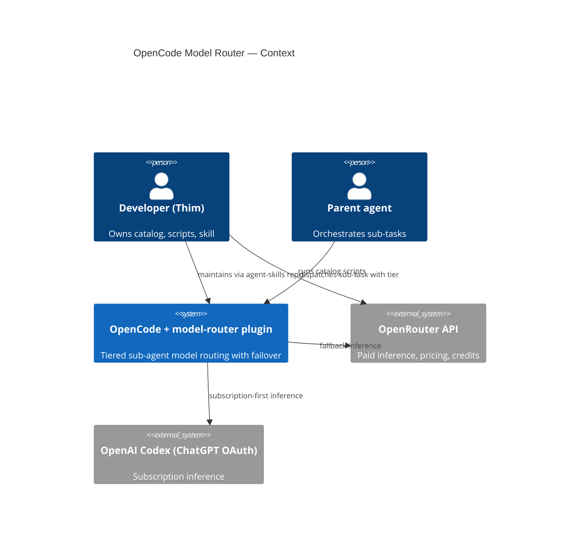
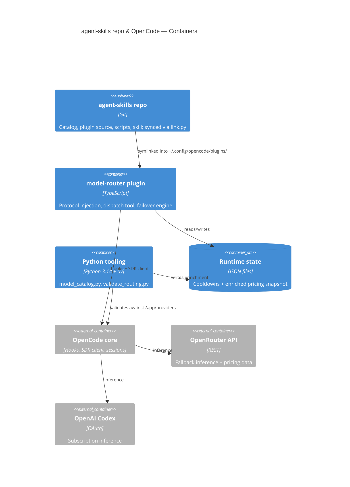
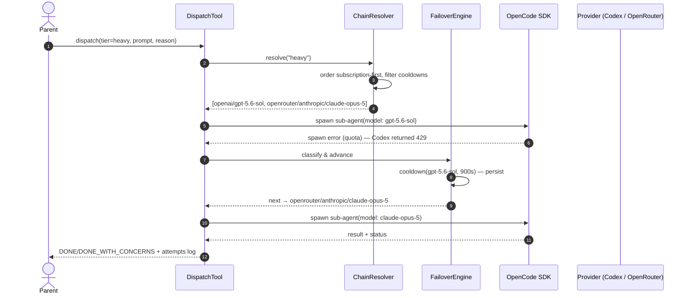

# OpenCode Model Router — Functional Technical Design

## 1. Document control

| Field | Value |
|-------|-------|
| Document ID | FTD-opencode-model-router-v1.0 |
| Scenario | project |
| Author | Thim (The Dutch Vision Group) |
| Date | 2026-08-19 |
| Status | Draft |
| Classification | Internal |

### Revision history

| Version | Date | Author | Change |
|---------|------|--------|--------|
| 0.1 | 2026-08-19 | Thim | Initial draft |

## Table of contents

1. Document control
2. Executive summary
3. Scope & objectives
4. Stakeholders & RACI
5. Business context & goals
6. User stories
7. Acceptance criteria
8. Traceability matrix
9. Definition of Ready / Definition of Done
10. Architecture
11. Data model
12. API & integration
13. Non-functional requirements
14. Privacy-by-design
15. Security-by-design
16. Risk register
17. Deployment & rollback
18. Observability & logging
19. Glossary
20. Approvals & sign-off
21. Omitted sections & open questions

## 2. Executive summary

OpenCode agents currently inherit the parent's model or a static per-agent model; there is no way for the parent to pick a model per sub-task, and no cross-provider failover exists (native fallback is an open feature request, sst/opencode#7602). This design adds a **model-router plugin** that injects a compact routing protocol into the orchestrator's system prompt and exposes a **`dispatch` tool**: the parent selects a tier (fast/medium/heavy), the plugin resolves a **subscription-first failover chain** from a git-versioned catalog (`routing.json`), spawns the sub-agent via the SDK, and on quota/rate-limit/auth/5xx errors mechanically retries the next model with a persisted cooldown. Two Python scripts enrich the catalog with live OpenRouter pricing and validate every catalog entry against the running OpenCode instance. Risk is contained by graceful degradation: an invalid catalog or missing hook disables routing with one warning instead of breaking OpenCode.

## 3. Scope & objectives

### 3.1 Problem statement

Sub-agents all run on the parent's OpenRouter model: too expensive for mechanical work, wasteful of the paid Codex (ChatGPT) subscription, and a single provider outage kills long-running agent workflows. The cost of doing nothing is continued overspend on paid tokens and fragile delegation.

### 3.2 In scope

- `opencode/plugins/model-router/` — TypeScript plugin: protocol injection, `dispatch` tool, chain resolver, failover engine, cooldown store, catalog loader
- `routing.json` + `routing.schema.json` — hand-picked model catalog with 3 tiers and per-tier ordered chains
- Registered tier agents (fast/medium/heavy) as fallback spawn mechanism
- `scripts/model_catalog.py` — OpenRouter pricing/credits enrichment
- `scripts/validate_routing.py` — catalog validation against live OpenCode
- `skills/using-subagents/` model-routing rules + `scripts/link.py` sync support for the plugin directory

### 3.3 Out of scope

- External routers/proxies (LiteLLM, Vercel AI Gateway)
- Mid-session model switching (OpenCode cannot switch a running session's model)
- Native OpenCode fallback (only monitor sst/opencode#7602, #9575)
- Routing outside OpenCode (skill guidance stays harness-agnostic)
- Non-OpenRouter, non-Codex providers (chain format stays provider-agnostic though)

### 3.4 Success criteria

- 100% of delegated sub-tasks run on a model from the approved catalog — no accidental default-model dispatches (verified via session metadata)
- Subscription models are attempted first whenever not in cooldown (≥ 50% of sub-agent tokens on subscription models within 2 months)
- A simulated provider outage causes zero failed delegations (failover completes within NFR-03)
- `validate_routing.py` exits 0 on the live workstation before every routing change is considered done

## 4. Stakeholders & RACI

### 4.1 Stakeholders

| Name | Role | Interest |
|------|------|----------|
| Thim | Owner / developer / approver | Cost efficiency, subscription utilisation, reliable delegation |
| TDVG AI agents | Implementers & consumers | Unambiguous routing rules, dispatch contract |

### 4.2 RACI matrix

| Activity | Responsible | Accountable | Consulted | Informed |
|----------|-------------|-------------|-----------|----------|
| FTD authoring | Thim (with AI agent) | Thim | — | — |
| Implementation | AI agents (using-subagents workflow) | Thim | Thim | Thim |
| Approval | Thim | Thim | — | — |

## 5. Business context & goals

### 5.1 Business context

This project extends the TDVG agent-skills repo — the single source of truth for shared AI-agent configuration, synced to all harnesses via symlinks (`link.py`). Sub-agent orchestration is already standardised (`using-subagents` skill); model choice is the missing control point.

### 5.2 Benefit hypothesis

We believe **subscription cost efficiency** will improve if **parent agents** successfully **route sub-tasks through tiered, subscription-first model selection** with the model-router plugin.

- **Business outcome (measurable):** ≥ 50% reduction of OpenRouter credit spend on sub-agent tasks within 2 months of adoption
- **User outcome:** agents dispatch to fast/medium/heavy tiers matching task complexity, with Codex models tried first
- **Validation method:** OpenRouter usage dashboard + model IDs recorded in OpenCode session metadata, before/after comparison
- **Baseline:** all sub-agents inherit the parent's OpenRouter model
- **Target:** ≥ 50% of sub-agent tokens on subscription models

### 5.3 Constraints

- OpenCode ≥ 1.18.x plugin hooks (`chat.params`, `chat.message`, `experimental.chat.system.transform`, custom tools, SDK client) — verified on 1.18.18; `experimental.*` hooks may change across versions
- Python ≥ 3.14 + uv (repo convention); English repo content; no secrets in repo
- `opencode-model-router` (GPL-3.0) is an inspiration for patterns only — no code copying
- Codex quota is opaque (no public quota API) → detection must be reactive

## 6. User stories

All stories are INVEST-checked (I/N/V/E/S/T pass; deviations noted).

#### US-01: Tier-based model selection per sub-task
**As a** parent agent, **I want** to select a model tier (fast/medium/heavy) per sub-task via a `dispatch` tool, **so that** cost and capability match the task.
INVEST: passes all; Independent of US-04..06 (catalog ships with defaults). **Priority:** Must

#### US-02: Subscription-first routing
**As a** owner, **I want** subscription models (Codex) ordered before paid OpenRouter models in every chain, **so that** the subscription is fully utilised before credits are spent.
INVEST: passes all. **Priority:** Must

#### US-03: Automatic failover with cooldown
**As a** parent agent, **I want** failed dispatches (429/quota/auth/5xx) retried on the next chain model automatically, **so that** delegation survives provider outages without user intervention.
INVEST: passes all. **Priority:** Must

#### US-04: Centralized, versioned catalog
**As a** owner, **I want** tiers, chains, models, and failover policy in one git-versioned `routing.json`, **so that** routing policy is central, reviewable, and synced everywhere.
INVEST: passes all. **Priority:** Must

#### US-05: Live pricing & availability enrichment
**As a** owner, **I want** a script that enriches the catalog with OpenRouter pricing and credit data, **so that** catalog decisions use current data.
INVEST: passes all. **Priority:** Should

#### US-06: Catalog validation against live OpenCode
**As a** owner, **I want** a script that checks every catalog entry against the running OpenCode instance (providers, models, auth, plugin load), **so that** misconfiguration is caught before it silently breaks routing.
INVEST: passes all. **Priority:** Must

#### US-07: Skill encodes routing rules
**As a** TDVG agent, **I want** the `using-subagents` skill to specify tier-selection and dispatch rules, **so that** every harness dispatches cost-efficiently and consistently.
INVEST: passes all; Valuable to benefit hypothesis. **Priority:** Should

## 7. Acceptance criteria
<!-- ac-format: bullets -->

### 7.1 US-01: Tier-based model selection
- The `dispatch` tool accepts `tier` (`fast|medium|heavy`) or `model` (a catalog id) plus a task prompt and an optional logged `reason`, and returns the sub-agent's status summary
- Given `tier=fast` and no active cooldowns, the sub-agent runs on the first model of the fast chain (asserted via session metadata `providerID/modelID`)
- Calls with neither `tier` nor `model`, or with an id not in the catalog, are rejected with a validation error listing valid options

### 7.2 US-02: Subscription-first routing
- Given a chain starting with a subscription model and no cooldown, dispatch selects that subscription model first (asserted via session metadata)
- Chain ordering comes from `routing.json` only — no provider logic in code — and `validate_routing.py` warns when a chain lists a non-subscription model before a subscription one
- When the subscription model is in cooldown, dispatch resolves to the next chain entry without user action

### 7.3 US-03: Automatic failover with cooldown
- On a spawn error classified `rate_limit|quota|auth|server_error`, the next chain entry is attempted within 5 seconds
- A failed model receives a cooldown entry (default 900 s) persisted to disk that survives an OpenCode restart
- After `max_attempts` (default 3) the tool returns `BLOCKED` with a structured error listing attempted models and reasons — it never silently falls back to the parent's model
- Validation errors (bad args, unknown model) never trigger failover

### 7.4 US-04: Centralized catalog
- `routing.json` is validated against `routing.schema.json` at plugin load; an invalid catalog disables routing with exactly one warning log and OpenCode continues normally
- Model entries support at least: `provider`, `subscription` (bool), `use_cases`, `notes`
- The catalog is synced to `~/.config/opencode/plugins/model-router/` via `link.py` and versioned in git

### 7.5 US-05: Pricing enrichment
- `model_catalog.py` fetches OpenRouter `GET /api/v1/models` and `GET /api/v1/credits` and writes a schema-validated enrichment file (pricing + credit snapshot)
- The API key is read exclusively from the `OPENROUTER_API_KEY` environment variable and never written to repo files
- Malformed API responses abort with a non-zero exit code and a clear error message

### 7.6 US-06: Catalog validation
- `validate_routing.py` starts a headless OpenCode server, queries `GET /app/providers`, and verifies every catalog chain entry exists in the live provider/model list
- Any entry that is unavailable (provider missing, model missing, no auth) produces a finding with severity; any error-severity finding exits non-zero
- The script also asserts the plugin loaded without hook errors (from the OpenCode log)

### 7.7 US-07: Skill update
- `using-subagents/SKILL.md` Phase 2 contains tier-selection rules mapping task types to tiers and records model routing in the work plan
- Phase 4's delegation contract instructs OpenCode dispatches to use the `dispatch` tool (tier + subscription-first), and documents degradation for other harnesses
- The skill change is synced to all harnesses via `link.py`

## 8. Traceability matrix

| ID | Requirement | Design component | Artefact | Test case | Status |
|----|-------------|------------------|----------|-----------|--------|
| US-01 | Tier selection | DispatchTool, ChainResolver | `opencode/plugins/model-router/index.ts` | TC-01 | Open |
| US-02 | Subscription-first | ChainResolver (ordering) | `routing.json` | TC-02 | Open |
| US-03 | Failover + cooldown | FailoverEngine, CooldownStore | `index.ts`, cooldown state file | TC-03 | Open |
| US-04 | Catalog | CatalogLoader | `routing.json`, `routing.schema.json` | TC-04 | Open |
| US-05 | Enrichment | model_catalog.py | `scripts/model_catalog.py` | TC-05 | Open |
| US-06 | Validation | validate_routing.py | `scripts/validate_routing.py` | TC-06 | Open |
| US-07 | Skill rules | Phase 2/4 updates | `skills/using-subagents/SKILL.md` | TC-07 | Open |

## 9. Definition of Ready / Definition of Done

### 9.1 Definition of Ready
- [ ] Story in "As a…/I want…/so that…" format with INVEST check
- [ ] Acceptance criteria written as testable bullets
- [ ] Dependencies identified (OpenCode hook availability, catalog entries present)
- [ ] Security implication assessed (§15: injection surface, secrets)

### 9.2 Definition of Done
- [ ] Implementation complete and merged via the using-subagents workflow (independent review included)
- [ ] Acceptance criteria demonstrated
- [ ] `validate_routing.py` exits 0 on the live workstation
- [ ] Graceful-degradation path verified (invalid catalog → warning, OpenCode unaffected)
- [ ] This FTD updated for material deviations; OpenCode restarted and routing verified in the log

## 10. Architecture

### 10.1 C4 Context



### 10.2 C4 Container



### 10.3 C4 Component (plugin)

```mermaid
C4Component
    title model-router plugin — Components
    Container_Boundary(plugin, "model-router plugin")
    Component(loader, "CatalogLoader", "TS", "Loads + schema-validates routing.json; disables routing on invalid")
    Component(injector, "ProtocolInjector", "TS", "Injects catalog summary + routing rules into orchestrator system prompt; skips sub-agent sessions")
    Component(dispatch, "DispatchTool", "TS custom tool", "Parent-facing: tier/model → chain → sub-agent spawn")
    Component(resolver, "ChainResolver", "TS", "Subscription-first ordering, cooldown filtering")
    Component(failover, "FailoverEngine", "TS", "Classifies spawn errors, advances chain, writes cooldowns")
    Component(store, "CooldownStore", "TS", "Persisted cooldown state (JSON)")
    Rel(loader, injector, "provides catalog")
    Rel(dispatch, resolver, "resolve tier chain")
    Rel(resolver, store, "filter active cooldowns")
    Rel(dispatch, failover, "on spawn error")
    Rel(failover, store, "write cooldown")
```

### 10.4 Sequence — dispatch with failover



### 10.5 Design decisions (ADR-style)

#### ADR-01: Dispatch tool + SDK spawn, tier agents as fallback
- **Context:** the task tool has no per-dispatch `model` parameter (verified on 1.18.18) and SDK model overrides at agent-spawn are bug-prone (sst/opencode#18615).
- **Decision:** the plugin's `dispatch` custom tool resolves the chain and spawns the sub-agent via the SDK client; three tier agents (fast/medium/heavy) with fixed models are also registered as a fallback spawn path if model overrides prove unreliable.
- **Status:** Accepted
- **Consequences:** works on current OpenCode; small indirection; runtime verification of the SDK path is an open question (OQ-2).
- **Alternatives:** static per-agent models only (loses parent choice); waiting for native fallback (blocks value).

#### ADR-02: Mechanical failover in code, not prompt guidance
- **Context:** opencode-model-router expresses fallback chains in the injected prompt, relying on the LLM to retry.
- **Decision:** failover is deterministic plugin code keyed on classified errors; the LLM only chooses the tier.
- **Status:** Accepted
- **Consequences:** deterministic, testable, independent of model compliance; more plugin code to maintain.

#### ADR-03: Subscription-first is config, not code
- **Context:** provider landscape may change; hardcoding provider priority would not survive that.
- **Decision:** chain order in `routing.json` expresses priority; the resolver only orders by config and filters cooldowns; the validation script warns when a non-subscription model precedes a subscription one.
- **Status:** Accepted — **Consequences:** flexible; relies on catalog discipline, guarded by validation.

#### ADR-04: Catalog in the repo, synced by symlinks
- **Decision:** `routing.json` lives in agent-skills (single source of truth), symlinked into `~/.config/opencode/plugins/model-router/` via `link.py`; changes need re-link + restart.
- **Status:** Accepted — **Consequences:** versioned, reviewable, consistent with repo philosophy.

#### ADR-05: Graceful degradation
- **Decision:** invalid catalog, missing hooks, or spawn-path failures disable routing with a single warning log; OpenCode keeps working without routing.
- **Status:** Accepted — **Consequences:** no hard dependency on `experimental.*` hooks; silent degradation risk mitigated by validation script and log events.

### 10.6 Quality scenarios
- **Availability:** Codex quota exhausted mid-run → next chain model completes the dispatch within 5 s (NFR-03).
- **Robustness:** corrupt `routing.json` → routing disabled, one warning, all other OpenCode functionality unaffected (AC 7.4).
- **Performance:** protocol injection ≤ 600 tokens so context budget is not materially consumed (NFR-02).

## 11. Data model

### 11.1 Catalog schema (`routing.json`)

```json
{
  "$schema": "./routing.schema.json",
  "version": 1,
  "tiers": {
    "fast":   { "chain": ["openai/gpt-5.1-codex-mini", "openrouter/moonshotai/kimi-k3"] },
    "medium": { "chain": ["openai/gpt-5.6-sol", "openrouter/z-ai/glm-5.3-air"] },
    "heavy":  { "chain": ["openai/gpt-5.6-sol#xhigh", "openrouter/anthropic/claude-opus-5"] }
  },
  "models": {
    "openai/gpt-5.6-sol": { "provider": "openai", "subscription": true, "use_cases": ["implementation", "review"] },
    "openrouter/z-ai/glm-5.3-air": { "provider": "openrouter", "subscription": false, "use_cases": ["implementation"] }
  },
  "failover": { "triggers": ["rate_limit", "quota", "auth", "server_error"], "cooldown_seconds": 900, "max_attempts": 3 },
  "protocol": { "max_tokens": 600 }
}
```

### 11.2 Entities

| Entity | Description | PII? | Source | Retention |
|--------|-------------|------|--------|-----------|
| Tier | id + ordered chain of model ids | no | routing.json | repo lifetime |
| Model entry | provider, subscription flag, use_cases, notes, enriched pricing | no | routing.json + OpenRouter API | repo lifetime |
| Failover policy | triggers, cooldown_seconds, max_attempts | no | routing.json | repo lifetime |
| Cooldown record | model id, until-timestamp, reason | no | runtime state file | until expiry |
| Enrichment snapshot | pricing/credits + fetched_at | no | model_catalog.py output | refreshed per run |

No ERD: the catalog is a JSON document tree, not a relational model — schema + entity table above carry the design.

## 12. API & integration

| Interface | Direction | Purpose | Error handling |
|-----------|-----------|---------|----------------|
| `dispatch` custom tool (in-process) | parent → plugin | tier/model + prompt → sub-agent spawn | classified errors advance chain; exhaustion → `BLOCKED` |
| Plugin hooks: `chat.message`, `experimental.chat.system.transform` | OpenCode → plugin | sub-agent detection (skip-guard), protocol injection | hook absence → routing disabled (ADR-05) |
| SDK client session spawn | plugin → OpenCode | create sub-agent session with resolved model | spawn error → FailoverEngine |
| OpenRouter `GET /api/v1/models`, `GET /api/v1/credits`, `GET /api/v1/key` | scripts → OpenRouter | pricing, credits, key limits | non-zero exit on malformed response |
| `opencode serve` + `GET /app/providers` | scripts → OpenCode | live provider/model/auth inventory | non-zero exit on missing entry |

## 13. Non-functional requirements

| ID | Subject | Attribute | Metric | Threshold | Verification |
|----|---------|-----------|--------|-----------|-------------|
| NFR-01 | `dispatch` tool | performance | added latency p95 (excl. LLM runtime) | ≤ 500 ms | instrumented timestamps in plugin log, local benchmark |
| NFR-02 | ProtocolInjector | resource usage | injected protocol size | ≤ 600 tokens | token count asserted in validation script |
| NFR-03 | FailoverEngine | recovery | time from classified error to next attempt | ≤ 5 s | integration test with simulated 429 |
| NFR-04 | CooldownStore | reliability | cooldown survival across restart | 100% | unit test with state file |
| NFR-05 | validate_routing.py | coverage | catalog chain entries checked against live instance | 100%, exit ≠ 0 on error finding | script run on workstation |
| NFR-06 | Plugin | compatibility | OpenCode ≥ 1.18.x load, graceful disable on missing hooks | loads without error or disables with 1 warning | smoke test per upgrade |

## 14. Privacy-by-design

No personal data is processed. The plugin routes prompts and code (the user's own content) to providers already configured in OpenCode — no new data flows, no new recipients. Routing logs contain model ids, tiers, error classes, and timestamps only — never prompt content. The cooldown state file contains model ids and timestamps only. `model_catalog.py` fetches public pricing data; the API key stays in the environment. DPIA: not required — no personal data, no profiling.

## 15. Security-by-design

- **Secrets:** none in the repo (hard repo rule); the plugin never reads `auth.json`; scripts read `OPENROUTER_API_KEY` from the environment only.
- **Supply chain:** plugin has zero runtime npm dependencies (type-only imports); the plugin makes no network calls — inference stays with OpenCode core.
- **Injection surface:** the injected protocol is generated exclusively from the repo-controlled, schema-validated `routing.json`; enrichment data is restricted to numeric pricing fields; `dispatch` args are enum/pattern-validated. Untrusted content (task prompts) is never interpolated into the system prompt.
- **STRIDE-lite:** Tampering (catalog edited) → schema validation + git history; Repudiation (routing decisions) → structured dispatch/failover logs; DoS (malformed catalog) → graceful disable (ADR-05); Spoofing/Elevation → not applicable (local, single-user tool).
- **ASVS level:** L1 — local developer tooling with no externally reachable surface.

## 16. Risk register

| ID | Risk | L | I | Mitigation | Owner | Status |
|----|------|---|---|------------|-------|--------|
| R-01 | SDK model override ignored at agent-spawn (#18615) | M | H | Tier-agent fallback spawn path (ADR-01); runtime verification OQ-2 | Thim | Open |
| R-02 | `experimental.*` hooks change/break on OpenCode upgrades | M | M | NFR-06 smoke test per upgrade; graceful degradation (ADR-05) | Thim | Open |
| R-03 | Codex quota exhausted (no proactive API) | H | M | By design: reactive failover + cooldown (US-03) | Thim | Open |
| R-04 | Prompt-injection via catalog content | L | M | Repo-controlled schema-validated catalog only (§15) | Thim | Open |
| R-05 | `link.py` lacks directory-sync support | M | L | Extend `link.py` (in scope, §3.2); verify with `status`/`list` | Thim | Open |
| R-06 | Protocol overhead degrades orchestrator context | M | L | NFR-02 token budget; trim rules in validation script | Thim | Open |

## 17. Deployment & rollback

- **Deployment:** commit to agent-skills → `uv run scripts/link.py link` (new item keys for `opencode/plugins/model-router/*`) → restart OpenCode (config loads at startup) → verify the `model-router` init log line and run `validate_routing.py` (exit 0).
- **Rollback:** `uv run scripts/link.py unlink` → restart OpenCode. Routing disappears; no data to migrate (runtime state is disposable).
- **Environments:** single workstation, global OpenCode config; no separate environments.

## 18. Observability & logging

- **Events (via `client.app.log`, service `model-router`):** `catalog.loaded`, `catalog.invalid`, `dispatch.started` (tier, model, reason), `dispatch.failover` (from → to, error class), `cooldown.set` (model, until), `routing.disabled` (cause).
- **Retention:** OpenCode log rotation applies; no separate retention policy (dev tooling).
- **No metrics/tracing:** local single-user tool; the validation script and log events cover operational insight.

## 19. Glossary

| Term | Definition |
|------|------------|
| Tier | Model class for a sub-task: fast (exploration), medium (implementation), heavy (architecture/security/debug) |
| Chain | Ordered model list per tier; order expresses failover priority |
| Subscription model | Model billed via a flat subscription (here: OpenAI Codex via ChatGPT OAuth) |
| Cooldown | Temporary exclusion of a model from chains after a classified failure |
| Catalog | `routing.json`: tiers, chains, model entries, failover policy |
| Protocol injection | Adding the routing protocol to the orchestrator's system prompt |
| Dispatch tool | Plugin-provided custom tool the parent calls to run a sub-task on a resolved model |
| Graceful degradation | Routing disables itself with one warning; OpenCode keeps working |
| OKF | Open Knowledge Format — frontmatter-bearing markdown for humans and agents |

## 20. Approvals & sign-off

| Role | Name | Date | Signature (digital) |
|------|------|------|----------------------|
| Owner / Product / Architecture | Thim | 2026-08-19 | scope summary approved in intake; final sign-off pending |

## 21. Omitted sections & open questions

Omitted recommended sections:
- C4 Component diagrams beyond the plugin (§10.3 covers the only new container) — omitted: no other new components
- Compliance evidence (§19 in template) — omitted: internal dev tooling, no regulatory exposure
- Migration & runbook (§20 in template) — omitted: greenfield, no data migration; rollback in §17
- Crosscutting Concepts (§22 in template) — omitted: single-plugin design; concerns live in §10/§12/§15
- Size budget: ~440 lines vs ~400 budget — consciously accepted after trim pass; the overage is table/diagram density (AC, NFR, ADR), not prose; further cuts would remove testable substance
- OKF house rule (lowercase-kebab-case filename) — consciously deviated: the FTD skill's mandated convention `FTD-[project]-vX.Y.md` was explicitly approved by the owner in intake

Open questions:
- OQ-1: Final hand-picked model list per tier — owner: Thim — before implementation start
- OQ-2: Runtime behaviour of SDK model override at agent-spawn (#18615) — resolved during the first implementation batch; decides primary vs tier-agent spawn path (ADR-01)
- OQ-3: Native model fallback landing in OpenCode (#7602, #9575) — monitored; if landed, the FailoverEngine can shrink to catalog + dispatch
- OQ-4: Does `link.py` sync plugin directories today, or is an extension needed (R-05)? — check during implementation batch 1
