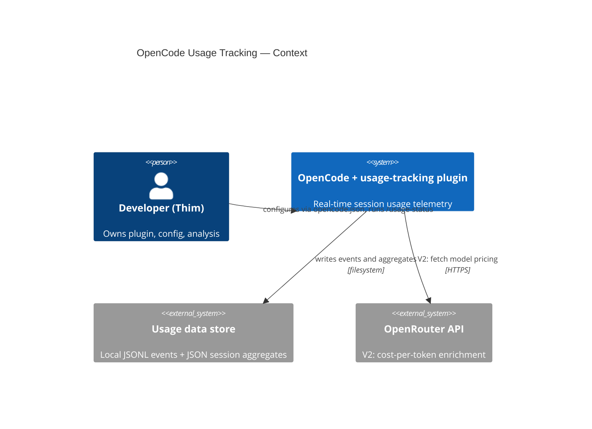
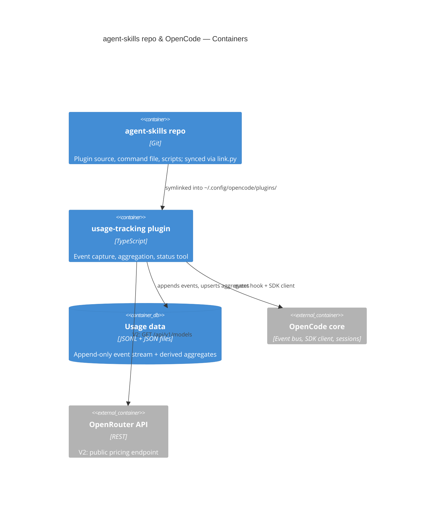
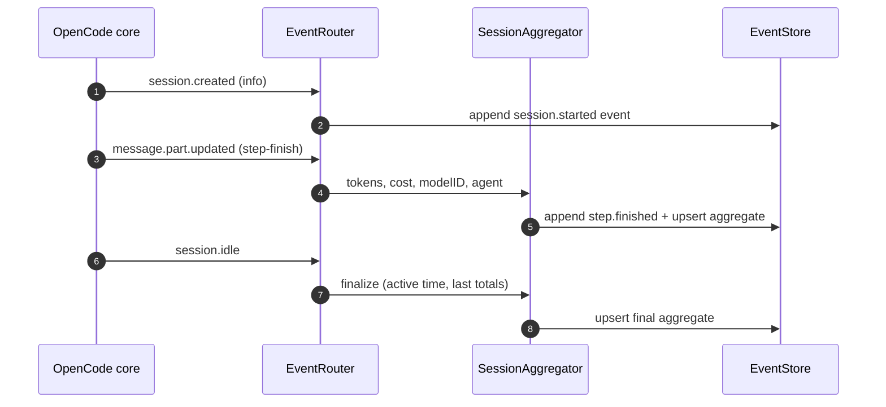

# OpenCode Usage Tracking — Functional Technical Design

## 1. Document control

| Field | Value |
|-------|-------|
| Document ID | FTD-opencode-usage-tracking-v1.0 |
| Scenario | project |
| Author | Thim (The Dutch Vision Group) |
| Date | 2026-08-20 |
| Status | Implemented |
| Classification | Internal |

### Revision history

| Version | Date | Author | Change |
|---------|------|--------|--------|
| 0.1 | 2026-08-20 | Thim | Initial draft |
| 1.0 | 2026-08-27 | Thim + AI agents | V1 implemented: OQ-1..3 resolved; loading route and stream extensions documented |

## Table of contents

1. Document control
2. Executive summary
3. Scope & objectives
4. Stakeholders & RACI
5. Business context & goals
6. User stories
7. Acceptance criteria
8. Traceability matrix
9. Definition of Ready / Definition of Done
10. Architecture
11. Data model
12. API & integration
13. Non-functional requirements
14. Privacy-by-design
15. Security-by-design
16. Risk register
17. Deployment & rollback
18. Observability & logging
19. Glossary
20. Approvals & sign-off
21. Omitted sections & open questions

## 2. Executive summary

OpenCode usage is currently only visible through aggregate totals (`opencode stats`); there is no per-session record of which models, agents, and subagents consumed which tokens at which cost. This design adds a **usage-tracking plugin** that subscribes to OpenCode's event bus and writes, in real time, an append-only **JSONL event stream** plus a continuously updated **session aggregate record** per session — covering project path, auto-generated session title, models with providers and reasoning variants, the token breakdown (input, output, reasoning, cache read/write), per-tool call counts, active agent time, and cost, recursively for all subagent child sessions. Output location and behavior are configurable via `opencode.json` tuple-options (project config overrides global; default is a central directory outside working repos to avoid dirty worktrees). V1 records OpenCode's own cost field; OpenRouter pricing enrichment is explicitly deferred to V2. Risk is contained by fail-open design: every plugin error is logged and swallowed — OpenCode itself is never affected.

## 3. Scope & objectives

### 3.1 Problem statement

TDVG runs OpenCode across projects with multiple models, providers, agents, and subagents. Costs are only visible after the fact as monthly totals; there is no attributable record of what a session, agent, or delegation actually consumed. The cost of doing nothing is continued blind spending and no data to base model-routing or delegation decisions on (see also FTD-opencode-model-router-v1.0 §5.1).

### 3.2 In scope

- `opencode/plugins/usage-tracking/` — TypeScript plugin: event capture, aggregation, JSONL event store, session aggregates, status tool
- `opencode/command/usage-status.md` — slash command invoking the status tool
- Config surface via `opencode.json` plugin tuple-options (output root, toggles), with per-project override
- Recursive subagent (child session) tracking at any depth via `parentID`
- Tool-call statistics (counts per tool name)
- Verification tooling: Bun unit tests + smoke-test script

### 3.3 Out of scope

- **Analysis or visualisation of the collected data** — collection only
- **OpenRouter API integration (cost-per-token enrichment)** — V2 (§10.5 ADR-04); V1 uses OpenCode's own `cost` field
- Mid-session cost recalculation when provider pricing changes
- Tracking of harnesses other than OpenCode
- Retention limits / rotation — unlimited by explicit owner choice

### 3.4 Success criteria

- 100% of sessions — including subagent child sessions — produce an aggregate record whose fields cover the complete intake list (project path, title, models + providers + variants, token breakdown, tool counts, active agent time, agents, subagents, cost), verified by smoke test over a scripted run incl. a subagent dispatch
- 0 OpenCode failures attributable to the plugin (NFR-02)
- Smoke script exits 0 on the live workstation

## 4. Stakeholders & RACI

### 4.1 Stakeholders

| Name | Role | Interest |
|------|------|----------|
| Thim | Owner / developer / approver | Cost transparency, attributable usage data |
| TDVG AI agents | Implementers & consumers | Unambiguous event schemas and config contract |

### 4.2 RACI matrix

| Activity | Responsible | Accountable | Consulted | Informed |
|----------|-------------|-------------|-----------|----------|
| FTD authoring | Thim (with AI agent) | Thim | — | — |
| Implementation | AI agents | Thim | Thim | Thim |
| Approval | Thim | Thim | — | — |

## 5. Business context & goals

### 5.1 Business context

This project extends the TDVG agent-skills repo — the single source of truth for shared AI-agent configuration, synced to all harnesses via symlinks (`link.py`). The model-router FTD adds cost-efficient routing; usage-tracking supplies the measurable evidence both to steer it and to audit it.

### 5.2 Benefit hypothesis

We believe **cost visibility** will improve if **Thim** successfully **inspects complete, automatically produced per-session usage records** with the usage-tracking plugin.

- **Business outcome (measurable):** at least one concrete cost-optimisation decision (e.g. rerouting a recurring workload to a cheaper model/agent) taken within 1 month of adoption, evidenced by collected data
- **User outcome:** every session — including subagents — has a complete, inspectable usage record without manual action
- **Validation method:** field-completeness check on collected records + documented optimisation decision
- **Baseline:** only aggregate `opencode stats` totals; no per-session/per-agent/per-model breakdown
- **Target:** 100% of sessions with complete records; ≥ 1 evidenced optimisation decision in month 1

### 5.3 Constraints

- OpenCode ≥ 1.18.x plugin hooks (`event`, custom tools, SDK client) — event schemas may evolve across versions
- Plugin is TypeScript on the OpenCode plugin host (Bun); repo tooling is otherwise Python ≥ 3.14 + uv
- English repo content; no secrets in the repo
- opencode-tokenscope and opencode-token-monitor are inspiration for patterns only — no code copying

## 6. User stories

All stories are INVEST-checked (I/N/V/E/S/T pass; deviations noted).

#### US-01: Real-time session usage capture
**As a** owner, **I want** every OpenCode session logged automatically in real time (project path, auto-generated title, models + providers, token usage, cost, active agent, durations), **so that** complete usage records exist without manual action.
INVEST: passes all; Independent of US-05/06. **Priority:** Must

#### US-02: Per-step token breakdown & tool statistics
**As a** owner, **I want** the token breakdown per step (input, output, reasoning, cache read/write) plus per-tool call counts per session, **so that** I can see where tokens are actually spent.
INVEST: passes all. **Priority:** Must

#### US-03: Recursive subagent tracking
**As a** owner, **I want** all subagent child sessions — at any nesting depth — tracked with the same fields as top-level sessions, **so that** delegation costs are attributable per subagent.
INVEST: passes all. **Priority:** Must

#### US-04: Configurable storage & per-project scoping
**As a** owner, **I want** output location and behavior configurable via `opencode.json` tuple-options, where project config overrides global and the default is a central directory outside working repos, **so that** data stays scoped per project without dirtying git worktrees.
INVEST: passes all. **Priority:** Must

#### US-05: Status command
**As a** owner, **I want** a status command showing write health and current-session totals, **so that** I can verify logging works and see live usage.
INVEST: passes all. **Priority:** Should

#### US-06: Verification tooling
**As a** owner, **I want** Bun unit tests and a smoke-test script against a live OpenCode instance, **so that** OpenCode upgrades don't silently break logging.
INVEST: passes all. **Priority:** Must

## 7. Acceptance criteria
<!-- ac-format: bullets -->

### 7.1 US-01: Real-time session usage capture
- On `session.created`, the plugin writes a `session.started` event containing sessionID, parentID (if any), projectID, directory/worktree path, agent name, model `{id, providerID, variant}`, and timestamp
- On every `message.part.updated` event whose part is of type `step-finish`, the plugin appends a `step.finished` event within 1 second containing sessionID, messageID, partID, modelID, providerID, agent, `tokens {input, output, reasoning, cache.read, cache.write}`, and cost
- On `session.idle`, the plugin finalises the session aggregate with active agent time (sum of step durations) and final totals
- The auto-generated session title is written to the aggregate as soon as it becomes available (session rename/update event)
- A model switch within a session results in all used models being present in the aggregate's model list
- No message text, prompt content, or tool output is ever written to storage

### 7.2 US-02: Per-step token breakdown & tool statistics
- Each `step.finished` event records the complete token breakdown including cache read, cache write, and reasoning tokens
- Tool invocations are counted per tool name per session (captured from tool events/parts)
- The aggregate contains per-tool call counts for the session

### 7.3 US-03: Recursive subagent tracking
- Child sessions (those with a `parentID`) are tracked with the same event set as top-level sessions, at any nesting depth
- The parent aggregate lists all child sessions with sessionID, agent name, nesting depth, and their usage totals
- Subagent usage is included in the parent's totals (and also available separately per child record)

### 7.4 US-04: Configurable storage & per-project scoping
- With no options configured, data is written under `~/.local/share/opencode-usage/` in a per-project directory (derived from projectID/path)
- A project-level `opencode.json` plugin entry overrides the global entry's options (OpenCode config merge order)
- No file is written inside any git worktree unless `output` is explicitly configured to a worktree path
- Unknown options or invalid values are ignored with exactly one warning; OpenCode continues normally

### 7.5 US-05: Status command
- The `usage_status` tool returns: configured output path, counts of tracked sessions/events, last write timestamp, error count, and the current session's running totals (tokens + cost)
- The `/usage-status` command file invokes the `usage_status` tool and returns its output verbatim

### 7.6 US-06: Verification tooling
- Bun unit tests cover event mapping, aggregation logic, config parsing, and error isolation
- The smoke script asserts: plugin loaded, a scripted session (including a subagent dispatch) produces an aggregate, and all written files are valid JSON/JSONL
- The smoke script exits non-zero when any assertion fails

## 8. Traceability matrix

| ID | Requirement | Design component | Artefact | Test case | Status |
|----|-------------|------------------|----------|-----------|--------|
| US-01 | Real-time capture | EventRouter, SessionAggregator, EventStore | `opencode/plugins/usage-tracking/index.ts` | TC-01 | Implemented (bun suite 49 green) |
| US-02 | Token breakdown + tool stats | SessionAggregator | idem | TC-02 | Implemented (bun suite 49 green) |
| US-03 | Subagent tracking | EventRouter + SessionAggregator (parentID from events) | idem | TC-03 | Implemented (bun suite 49 green) |
| US-04 | Config + scoping | ConfigResolver | opencode.json plugin entry | TC-04 | Implemented (bun suite 49 green) |
| US-05 | Status command | StatusTool + command file | `opencode/command/usage-status.md` | TC-05 | Implemented (bun suite 49 green) |
| US-06 | Verification | Bun tests + smoke script | `scripts/smoke_usage_tracking.sh` | TC-06 | Implemented — bun suite 49 green; live smoke pending owner |

## 9. Definition of Ready / Definition of Done

### 9.1 Definition of Ready
- [ ] Story in "As a…/I want…/so that…" format with INVEST check
- [ ] Acceptance criteria written as testable bullets
- [ ] Dependencies identified (event availability, plugin options support — OQ-1/2/3); security implication assessed (§15)

### 9.2 Definition of Done
- [ ] Implementation complete and merged (independent review included)
- [ ] Acceptance criteria demonstrated
- [ ] Bun tests green; smoke script exits 0 on the live workstation
- [ ] Fail-open path verified (induced write failure leaves OpenCode unaffected)
- [ ] This FTD updated for material deviations; OpenCode restarted and logging verified via `/usage-status`

## 10. Architecture

### 10.1 C4 Context



### 10.2 C4 Container



### 10.3 Sequence — session lifecycle capture



### 10.4 Design decisions (ADR-style)

Plugin components referenced below — EventRouter (event dispatch, fail-open wrapper), SessionAggregator (totals, tool counts, active time — idempotent), EventStore (JSONL append + aggregate upsert), ConfigResolver (tuple-options), StatusTool — are enumerated in §8 and §12. V1 takes the event-only route: the planned MetadataResolver/SDK lookups are not used — title, model/variant, and child-session metadata come from event fields, and the SDK client serves only `app.log` (§12).

#### ADR-01: Real-time event-hook capture
- **Context:** command-triggered export (TokenScope-style) loses crashed sessions; polling OpenCode's SQLite storage (Tokscale-style) couples to internal formats.
- **Decision:** subscribe to the event bus (`event` hook) and write immediately.
- **Status:** Accepted
- **Consequences:** data survives crashes; small per-event cost; dependent on event schema stability (R-01).

#### ADR-02: Two-layer output — append-only JSONL + derived aggregate
- **Decision:** raw events go to an append-only JSONL stream; the session aggregate is a derived, idempotent reduction, always rebuildable from the stream.
- **Status:** Accepted
- **Consequences:** corrupted aggregates recoverable by replay; slightly more write logic; maximal analysis freedom.

#### ADR-03: Central default storage, per-project override via tuple-options
- **Context:** in-repo storage dirties worktrees and risks cleanup loss.
- **Decision:** default output root `~/.local/share/opencode-usage/` with per-project subdirectories; `opencode.json` tuple-options override per project (native config merge).
- **Status:** Accepted
- **Consequences:** no git pollution by default; tuple-options support for local paths must be verified (OQ-1).

#### ADR-04: V1 uses OpenCode's cost field; OpenRouter enrichment is V2
- **Context:** OpenCode's `step-finish` cost is a models.dev-based calculation; OpenRouter's public pricing endpoint gives per-token prices for higher accuracy.
- **Decision:** V1 records OpenCode's cost field as-is; OpenRouter `GET /api/v1/models` enrichment (cached, with fallback) is deferred to V2.
- **Status:** Accepted
- **Consequences:** V1 works fully offline with zero network calls; recorded cost may deviate from actual OpenRouter billing until V2.

#### ADR-05: Fail-open graceful degradation
- **Decision:** every hook invocation is wrapped; any plugin error is logged once (via `client.app.log`) and swallowed; OpenCode is never affected.
- **Status:** Accepted
- **Consequences:** worst case is a data gap, never a broken agent session.

#### ADR-06: Metadata-only logging
- **Decision:** store ids, models, tokens, costs, timestamps, paths, agent names, and the LLM-generated session title; never message text, prompts, or tool outputs.
- **Status:** Accepted
- **Consequences:** analysis value retained (title gives human context) with minimal privacy exposure (§14).

### 10.5 Quality scenarios
- **Performance:** step-finish events processed asynchronously; no measurable TUI/model latency impact (NFR-01).
- **Robustness:** read-only output path or disk full → events dropped with a single warning, OpenCode unaffected (ADR-05, R-05).
- **Recovery:** corrupted aggregate → deleted and rebuilt from the JSONL stream (ADR-02).

## 11. Data model

Document store (JSONL + JSON), not relational — no ERD; schemas and entity table below carry the design.

### 11.1 Event stream (`<outputRoot>/<project>/events.jsonl`, append-only)

```json
{"ts": 1786329800123, "type": "session.started", "sessionID": "ses_…", "parentID": null,
 "projectID": "prj_…", "directory": "/path", "agent": "build",
 "model": {"id": "glm-5.3", "providerID": "openrouter", "variant": null}}
{"ts": 1786329805456, "type": "step.finished", "sessionID": "ses_…", "messageID": "msg_…",
 "partID": "prt_…", "agent": "build", "modelID": "glm-5.3", "providerID": "openrouter",
 "tokens": {"input": 399574, "output": 170, "reasoning": 492, "cache": {"read": 3826, "write": 0}},
 "cost": 0.24179232, "stepMs": 5312}
{"ts": 1786329810000, "type": "tool.executed", "sessionID": "ses_…", "tool": "bash", "ok": true}
{"ts": 1786329815000, "type": "session.idle", "sessionID": "ses_…", "activeMs": 412000}
```

### 11.2 Session aggregate (`<outputRoot>/<project>/sessions/<sessionID>.json`, derived)

```json
{"sessionID": "ses_…", "parentID": null, "depth": 0, "project": "prj_…", "directory": "/path",
 "title": "Refactor link.py sync logic", "agents": ["build"],
 "models": [{"id": "glm-5.3", "provider": "openrouter", "variant": null}],
 "tokens": {"input": 0, "output": 0, "reasoning": 0, "cacheRead": 0, "cacheWrite": 0},
 "cost": 0.0, "activeMs": 0, "toolCounts": {"bash": 14, "edit": 6, "task": 2},
 "children": [{"sessionID": "ses_…", "agent": "explore", "depth": 1, "totals": "…same fields…"}],
 "time": {"created": 0, "updated": 0, "idle": 0}}
```

### 11.3 Entities

| Entity | Description | PII? | Source | Retention |
|--------|-------------|------|--------|-----------|
| Event (JSONL line) | Immutable observed telemetry fact | no (title text is LLM-generated) | OpenCode event bus | unlimited (owner choice) |
| Session aggregate | Derived per-session reduction; rebuildable from events | no | plugin aggregation | unlimited (owner choice) |
| Plugin options | output root, toggles | no | opencode.json tuple-options | repo lifetime |

### 11.4 Implementation notes (v1.0)

Extensions and deviations of the implemented V1 versus the schemas above (all verified by the 49-test Bun suite; see `.agents/runs/2026-08-26-opencode-usage-tracking/reports/`):

- **(a) `eventID` on every persisted record** — each `events.jsonl` line carries the source event envelope `id`, enabling multi-instance dedup and replay-safe rebuild (overlapping plugin instances and `rebuild()`/restart replay never double-count).
- **(b) New persisted record type `session.title`** — `{type, eventID, sessionID, title, ts}` from `session.updated`; the aggregate title is set from it (later non-empty title wins).
- **(c) Internal non-persisted records** — `message.info` and `step.started` are produced by the mapper for message/model correlation (model attribution via `messageID` join) and stepMs computation, but are filtered from `store.append`; they exist only in live memory.
- **(d) `session.idle` stream record** — carries `type`/`sessionID`/`eventID` only; `activeMs` and `time` live in the aggregate (idle carries sessionID only in the source event — OQ-2).
- **(e) Loading route** — default activation is auto-discovery via a flat entry file `opencode/plugins/usage-tracking.ts` re-exporting the module directory (verified: OpenCode scans only files directly in the plugins dir; the per-file subdirectory layout alone is not discoverable). Optional per-project tuple override (OQ-1: options delivered verbatim); event-ID dedup makes overlapping instances safe.
- **(f) NFR-06 warning** — implemented in EventStore as one fail-open warning per output root when the measured on-disk footprint (events + aggregates) exceeds 102400 bytes; writes continue.
- **(g) Security residuals accepted** — project-level `output` redirect is project-scoped trust: a project `opencode.json` is comparable in trust to the project's own plugin code (§15). In-memory retention is unbounded per process by design: a restart re-seeds from `events.jsonl` (dedup registries must stay grow-only for correctness), and eviction-on-idle was consciously rejected because `session.idle` fires after every turn.
- **(h) `stepMs` omitted from `step.finished` stream records** — step duration is folded into the aggregate's `activeMs`; the `step.started` pairing that measures it is in-memory only (note c), so replay derives no step durations from the persisted stream — replayed `step.finished` records contribute 0 `activeMs` (restart re-seeds all other totals; post-restart steps accumulate afresh).
- **(i) Per-record finalize serializes all retained sessions** — every processed record runs `finalize()`, which serializes all retained sessions (O(S) per event); accepted workstation-scale cost — state is per-process and a restart re-seeds it from `events.jsonl`. The NFR-01 benchmark covers `mapEvent` + `apply` only (measured 2026-08-27: 2000 samples, p50 0.001 ms, p95 0.006 ms, max 0.701 ms — PASS).

## 12. API & integration

| Interface | Direction | Purpose | Error handling |
|-----------|-----------|---------|----------------|
| OpenCode event bus (`event` hook) | OpenCode → plugin | session/message/tool events | try/catch per event; log once, never rethrow (ADR-05) |
| SDK client (`client.app.log`) | plugin → OpenCode | plugin log messages (§18); V1 resolves metadata from events — no SDK lookups | log failures swallowed (fail-open, ADR-05) |
| Local filesystem (Bun `fs`) | plugin → storage | JSONL append + aggregate upsert | write error → degrade (ADR-05, R-05) |
| `usage_status` custom tool + `/usage-status` command | user → plugin | write health + current session totals | read-only; errors reported inline |
| OpenRouter `GET /api/v1/models` | **V2:** plugin → OpenRouter | per-token pricing enrichment | cached (~24 h TTL); fallback to OpenCode cost field (ADR-04) |

## 13. Non-functional requirements

| ID | Subject | Attribute | Metric | Threshold | Verification |
|----|---------|-----------|--------|-----------|-------------|
| NFR-01 | Event pipeline | Performance | synchronous processing time per event (excl. disk write) | ≤ 5 ms p95 | Bun unit benchmark |
| NFR-02 | Plugin | Reliability | OpenCode failures caused by plugin errors | 0 | unit test injecting write failure; smoke test |
| NFR-03 | Event pipeline | Durability | events persisted after emission | 100% within 1 s | smoke test timestamps |
| NFR-04 | Plugin | Compatibility | OpenCode ≥ 1.18.x loads plugin without hook errors; missing hooks disable with 1 warning | loads or disables gracefully | smoke test per upgrade |
| NFR-05 | Core logic | Maintainability | Bun test line coverage (router, aggregator, config) | ≥ 80% | `bun test --coverage` |
| NFR-06 | Storage | Resource usage | disk footprint per average session (events + aggregate) | ≤ 100 KB | smoke test sample session |

NFR-05 measured (`bun test --coverage`, 49-test suite): config 100%, aggregate ~98% (branch; 91.67% line), mapping ~97% (branch; 100% line), store 100% — all above the 80% threshold. `index.ts`/`status.ts` are thin wiring/wrapper modules outside NFR-05's router/aggregator/config scope (exempt from the 80% rule).

## 14. Privacy-by-design

No personal data is processed: the plugin records ids, paths, model/provider names, token counts, costs, timestamps, agent names, and the LLM-generated session title — never message content, prompts, or tool outputs (ADR-06). The title can incidentally echo names a user typed; this is accepted as minimal, human-context metadata on a single-user workstation with local-only storage and no external data flows in V1. Data minimisation and purpose limitation are enforced by the event schema itself (§11). DPIA: not required — no personal-data processing, no profiling, no external recipients. Retention: unlimited by explicit owner decision (analysis is the purpose); deletion is a plain file removal. Privacy-friendly default: central local storage, no telemetry, no network calls.

## 15. Security-by-design

No secrets are read or written: the plugin touches no API keys (V1 makes zero network calls; V2 will use `OPENROUTER_API_KEY` from the environment only). Zero runtime npm dependencies (type-only imports). Filesystem writes go exclusively to the owner-configured output root; the path comes from trusted local config, not from model-controlled input. STRIDE-lite: Tampering (data files edited) → out of scope (local single-user, disposable derived data); Repudiation → events carry timestamps and ids; DoS (write failures, runaway sessions) → fail-open (ADR-05) + storage budget (NFR-06); Spoofing/Elevation of privilege → not applicable (no auth surface, no privilege boundary). ASVS level: L1 — local developer tooling with no externally reachable surface.

## 16. Risk register

| ID | Risk | L | I | Mitigation | Owner | Status |
|----|------|---|---|------------|-------|--------|
| R-01 | OpenCode event schema changes break mapping | M | M | NFR-04 smoke test per upgrade; tolerant parsing (unknown fields ignored) | Thim | Open |
| R-02 | Tuple-options unsupported for local plugin paths | M | H | Verify in implementation batch 1 (OQ-1); fallback: defaults + explicit entry in global config | Thim | Open |
| R-03 | `session.idle` payload differs from expectation | M | L | Idle is best-effort; aggregate is finalised idempotently on every update (ADR-02) | Thim | Open |
| R-04 | Internal agents (title/compaction) pollute subagent stats | M | L | Agent name recorded per session enables filtering in analysis; optional `excludeAgents` option | Thim | Open |
| R-05 | Disk full / read-only output root → data gaps | L | M | Fail-open with single warning; gap accepted in V1 (ADR-05) | Thim | Open |

## 17. Deployment & rollback

- **Deployment:** commit to agent-skills → `uv run scripts/link.py link` (new item keys: `opencode/plugins/usage-tracking/*`, `opencode/command/usage-status.md`) → restart OpenCode (plugins load at startup) → run the smoke script (exit 0) → verify via `/usage-status`.
- **Rollback:** `uv run scripts/link.py unlink` → restart OpenCode. Logging disappears; collected data is disposable and derived — no migration needed.
- **Environments:** single workstation; global default config plus optional per-project `opencode.json` overrides.

## 18. Observability & logging

- **Plugin events** (via `client.app.log`, service `usage-tracking`): `plugin.initialized`, `plugin.degraded` (cause), `write.error` (path, error class), `session.finalized` (sessionID, totals).
- **Operational insight:** `/usage-status` (write health, counters, current session totals) and the smoke script; no metrics/tracing infrastructure (local single-user tool). Retention: OpenCode log rotation; usage data unlimited by owner choice (§14).

## 19. Glossary

| Term | Definition |
|------|------------|
| Session / child session | OpenCode conversation unit; child sessions are spawned by the task tool and carry a `parentID` |
| step-finish part | Message part emitted at the end of each model step, carrying `tokens`, `cost`, and `reason` |
| Event stream | Append-only JSONL file of observed plugin events (raw layer) |
| Aggregate record | Derived per-session JSON document; rebuildable from the event stream |
| Tuple options | Plugin configuration form in `opencode.json`: `["<plugin>", { …options }]` |
| Variant | Model reasoning variant (e.g. `#xhigh` effort suffix) |
| Active agent time | Sum of step durations (step-start → step-finish), excluding user idle time |
| Fail-open | Plugin errors are logged and swallowed; the host keeps working |

## 20. Approvals & sign-off

| Role | Name | Date | Signature (digital) |
|------|------|------|----------------------|
| Owner / Product / Architecture | Thim | 2026-08-20 | scope summary approved in intake; final sign-off pending |

## 21. Omitted sections & open questions

Omitted recommended sections:
- C4 Component diagram (L3) — omitted: single container with five components already enumerated in §8 traceability, §10.4 and §12; the sequence diagram carries the design
- Compliance evidence (§19 in template) — omitted: internal dev tooling, no regulatory exposure
- Migration & runbook (§20 in template) — omitted: greenfield, no data migration; rollback in §17
- Crosscutting Concepts (§22 in template) — omitted: single-plugin design; concerns live in §10/§12/§15
- ERD — omitted: document store (JSONL/JSON), not a relational model; schemas + entity table in §11
- Accessibility audit — omitted: no user-facing UI; status output is plain terminal text
- LINDDUN threat table — omitted: no personal data processed (§14); STRIDE-lite covered in §15 prose
- **Size budget: ~430 lines vs ~400 budget — consciously accepted after trim pass (C4 L3 cut, ADRs and JSON contracts condensed); remaining overage is diagram/table/contract density, not prose
- OKF house rule (lowercase-kebab-case filename) — consciously deviated: the FTD skill's mandated convention `FTD-[project]-vX.Y.md` and consistency with the existing model-router FTD were explicitly approved by the owner in intake

Open questions:
- OQ-1: Does the plugin tuple-options form work for local plugin paths? — **Resolved YES** (2026-08-26 spike: `tupleOptionsReceived: true`, exact options delivered verbatim). Default activation is auto-discovery; tuple entry remains as the optional per-project override.
- OQ-2: Exact payloads of `session.idle` and session rename/update events — **Resolved** (2026-08-26 spike): `session.idle` carries sessionID only (finalisation is idempotent on every update); the title arrives via `session.updated.properties.info.title`.
- OQ-3: Availability of model variant/reasoning metadata in message events vs. SDK model lookup — **Resolved** (2026-08-26 spike): variant not observed live; recorded when present, `null` otherwise (tolerant parsing). Model attribution for steps comes from the `message.info` join on `messageID` — no SDK lookup needed.
- OQ-4: V2 OpenRouter enrichment scope (public pricing only vs. also authenticated credits/key endpoints) — **Parked for V2** (owner decision before V2 start; ADR-04).
