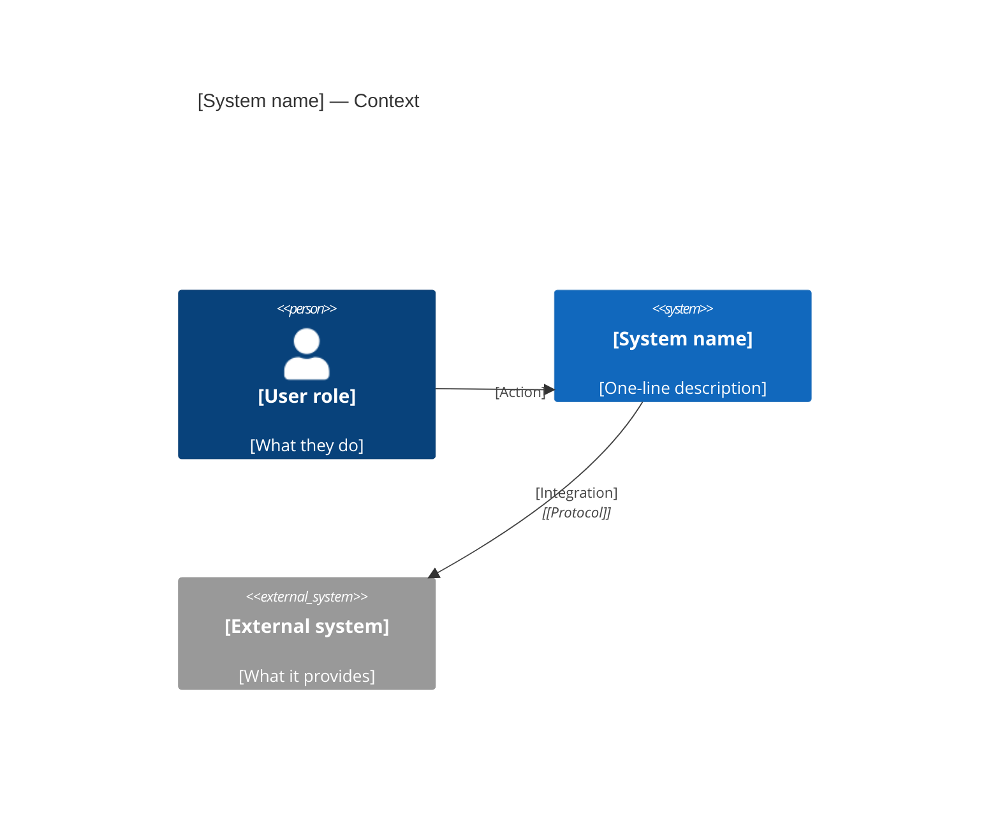
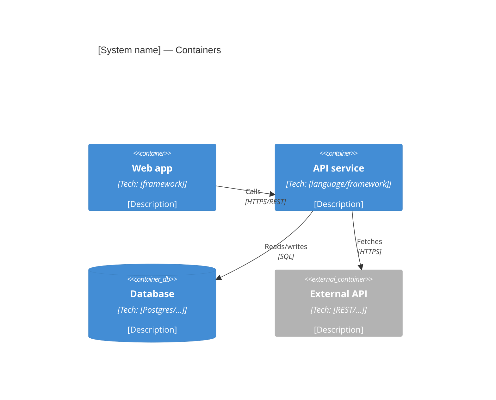
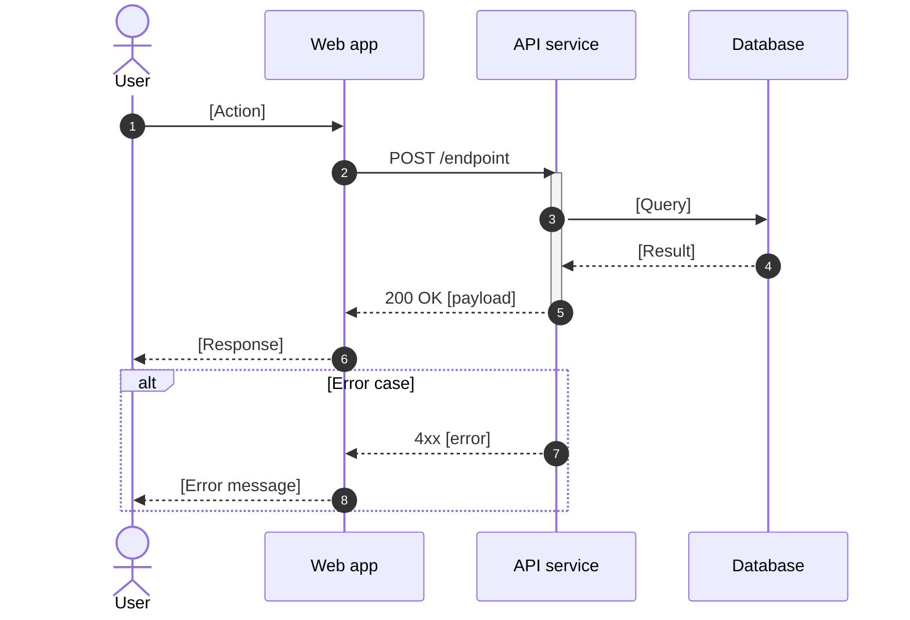
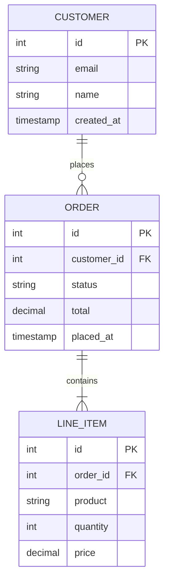
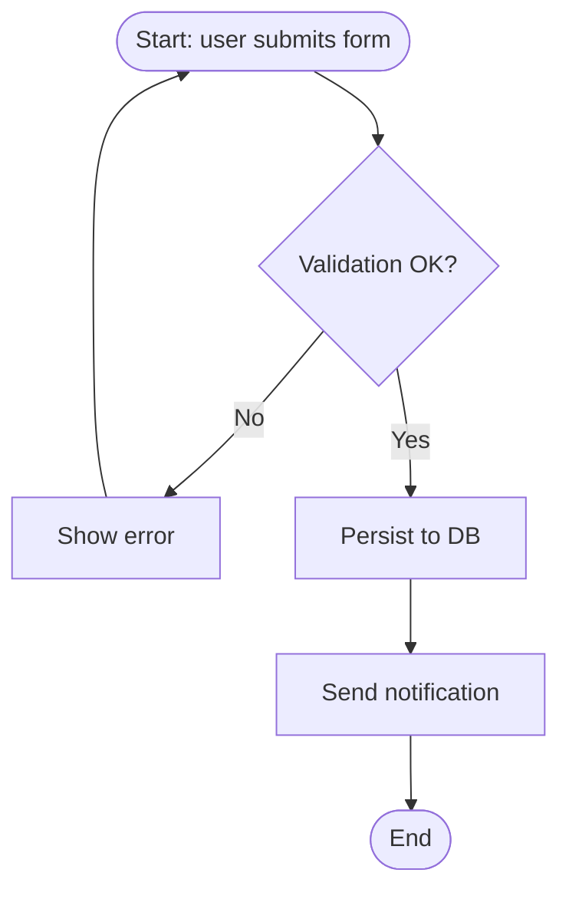

# Mermaid Snippets

## Contents
- C4 Context (Level 1)
- C4 Container (Level 2)
- C4 Component (Level 3)
- Sequence diagram
- ERD (data model)
- BPMN-style flow
- Embedding notes

Copy these snippets, replace the placeholders, and verify they render at https://mermaid.live or in the target environment.

## C4 Context (Level 1)

Shows the system in relation to its users and external systems. Always include in the FTD.



## C4 Container (Level 2)

Shows the containers (apps, services, datastores) and their relationships. Mandatory for project and enterprise.



## C4 Component (Level 3)

Shows components within a single container. Mandatory for enterprise; optional for project.

```mermaid
C4Component
    title [Container name] — Components

    Container_Boundary(api, "API service")

    Component(controller, "[Name]Controller", "[framework]", "[Description]")
    Component(service, "[Name]Service", "[language]", "[Description]")
    Component(repo, "[Name]Repository", "[ORM]", "[Description]")

    Rel(controller, service, "Calls")
    Rel(service, repo, "Uses")
```

## Sequence diagram

Shows the message flow between actors and components for a specific use case. Mandatory for project and enterprise (key flows).



## ERD (data model)

Shows entities, attributes, and relationships. Mandatory for project and enterprise.



## BPMN-style flow

For business process flows. Mermaid does not have native BPMN, but a flowchart approximates it.



## Embedding notes

- **Markdown mode:** Mermaid code blocks render natively in GitHub, GitLab, and most modern markdown renderers. In Confluence, use the Mermaid Editor plugin or paste the rendered SVG.
- **HTML mode:** Mermaid is loaded via CDN with a fallback. See [html-scaffold.md](html-scaffold.md) for the embedding pattern.
- **Diagram per flow:** do not cram every flow into one diagram. One sequence diagram per key use case; one ERD; one C4 per level.
- **Labels in the user's chosen language:** diagram labels follow the FTD language choice. Technical identifiers (entity names, endpoint paths) stay in English.
